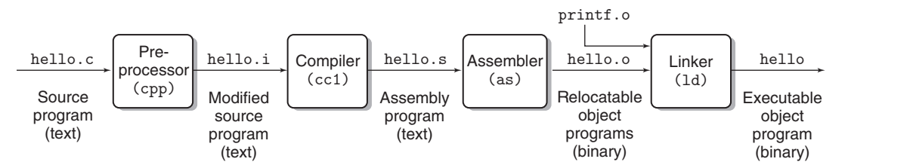

# Chapter 1: A Tour of Computer Systems

***

## Information Is Bits + Context

All information in a system—including disk files, programs stored in memory, user data stored in memory, and data
transferred across a network—is represented as a bunch of bits. The only thing that distinguishes different data objects
is the context in which we view them. For example, in different contexts, the same sequence of bytes might represent an
integer, floating-point number, character string, or machine instruction.

## The compilation system

```c
#include <stdio.h>

int main() {
    printf("hello world\n");
    return 0;
}
```



The gcc compiler driver reads the source file [hello.c](./hello.c) and translates it into an executable object file
hello. The translation is performed in the sequence of four phases. The programs that perform the four phases (
preprocessor, compiler, assembler, and linker) are known collectively as the compilation system.

### Preprocessing phase.

The preprocessor (cpp) modifies the original C program according to directives that begin with the ‘#’ character. For
example, the ```#include <stdio.h>``` command in line 1 of [hello.c](./hello.c) tells the preprocessor to read the
contents of the system header file stdio.h and insert it directly into the program text. The result is another C
program, typically with the .i suffix.

*We can use the following command to transfer a .c file to a .i file.*

```shell
gcc -E hello.c -o hello.i
```

### Compilation phase.

The compiler (cc1) translates the text file hello.i into the text file hello.s, which contains an assembly-language
program. This program includes the following definition of function main:

```asm
main:
    subq $8, %rsp
    movl $.LC0, %edi
    call puts
    movl $0, %eax
    addq $8, %rsp
    ret
```

*We can use the following command to transfer a .i file to a .s file.*

```shell
gcc -S hello.i -o hello.s
```

Assembly language is useful because it provides a common output language for different compilers for different
high-level languages. For example, C compilers and Fortran compilers both generate output files in the same assembly
language.

### Assembly phase.

Next, the assembler (as) translates hello.s into machine language instructions, packages them in a form known as a
relocatable object program, and stores the result in the object file hello.o. This file is a binary file containing 17
bytes to encode the instructions for function main. If we were to view hello.o with a text editor, it would appear to be
gibberish.

*We can use the following command to transfer a .s file to a .o file.*

```c
gcc -c hello.s -o hello.o
```

### Linking phase.

Notice that our hello program calls the printf function, which is part of the standard C library provided by every C
compiler. The printf function resides in a separate precompiled object file called printf.o, which must somehow be
merged with our hello.o program. The linker (ld) handles this merging. The result is the hello file, which is an
executable object file (or simply executable) that is ready to be loaded into memory and executed by the system.

*We can use the following command to transfer a .o file to an executable file.*

```c
gcc hello.o -o hello
```

### 总结

生成可执行程序过程为成四个步骤：

1. 由.c文件到.i文件，这个过程叫预处理。
2. 由.i文件到.s文件，这个过程叫编译。
3. 由.s文件到.o文件，这个过程叫汇编。
4. 由.o文件到可执行文件，这个过程叫链接。

***

## Hardware Organization of a System

### Buses

Running throughout the system is a collection of electrical conduits called buses that carry bytes of information back
and forth between the components. Buses are typically designed to transfer fixed-size chunks of bytes known as words.
The number of bytes in a word (the word size) is a fundamental system parameter that varies across systems. Most
machines today have word sizes of either 4 bytes (32 bits) or 8 bytes (64 bits). In this book, we do not assume any
fixed definition of word size. Instead, we will specify what we mean by a “word” in any context that requires this to be
defined.

### I/O Devices

Input/output (I/O) devices are the system’s connection to the external world. Our example system has four I/O devices: a
keyboard and mouse for user input, a display for user output, and a disk drive (or simply disk) for long-term storage of
data and programs. Initially, the executable hello program resides on the disk. Each I/O device is connected to the I/O
bus by either a controller or an adapter. The distinction between the two is mainly one of packaging. Controllers are
chip sets in the device itself or on the system’s main printed circuit board (often called the motherboard). An adapter
is a card that plugs into a slot on the motherboard. Regardless, the purpose of each is to transfer information back and
forth between the I/O bus and an I/O device.

### Main Memory

The main memory is a temporary storage device that holds both a program and the data it manipulates while the processor
is executing the program. Physically, main memory consists of a collection of dynamic random access memory (DRAM)
chips. Logically, memory is organized as a linear array of bytes, each with its own unique address (array index)
starting at zero. In general, each of the machine instructions that constitute a program can consist of a variable
number of bytes. The sizes of data items that correspond to C program variables vary according to type. For example, on
an x86-64 machine running Linux, data of type short require 2 bytes, types int and float 4 bytes, and types long and
double 8 bytes.

### Processor

The central processing unit (CPU), or simply processor, is the engine that interprets (or executes) instructions stored
in main memory. At its core is a word-size storage device (or register) called the program counter (PC). At any point in
time, the PC points at (contains the address of) some machine-language instruction in main memory.

From the time that power is applied to the system until the time that the power is shut off, a processor repeatedly
executes the instruction pointed at by the program counter and updates the program counter to point to the next
instruction. A processor appears to operate according to a very simple instruction execution model, defined by its
instruction set architecture. In this model, instructions execute in strict sequence, and executing a single instruction
involves performing a series of steps. The processor reads the instruction from memory pointed at by the program
counter (PC), interprets the bits in the instruction, performs some simple operation dictated by the instruction, and
then updates the PC to point to the next instruction, which may or may not be contiguous in memory to the instruction
that was just executed.

There are only a few of these simple operations, and they revolve around main memory, the register file, and the
arithmetic/logic unit (ALU). The register file is a small storage device that consists of a collection of word-size
registers, each with its own unique name. The ALU computes new data and address values. Here are some examples of the
simple operations that the CPU might carry out at the request of an instruction:

* Load: Copy a byte or a word from main memory into a register, overwriting the previous contents of the register.
* Store: Copy a byte or a word from a register to a location in main memory, overwriting the previous contents of that
  location.
* Operate: Copy the contents of two registers to the ALU, perform an arithmetic operation on the two words, and store
  the result in a register, overwriting the previous contents of that register.
* Jump: Extract a word from the instruction itself and copy that word into the program counter (PC), overwriting the
  previous value of the PC.

When we run the hello program, using a technique known as direct memory access (DMA, discussed in Chapter 6), data
stored in the executable file hello travels directly from disk to main memory, without passing through the processor.

## Caches matter

An important lesson from this simple example is that a system spends a lot of time moving information from one place to
another. The machine instructions in the hello program are originally stored on disk. When the program is loaded, they
are copied to main memory. As the processor runs the program, instructions are copied from main memory into the
processor. Similarly, the data string hello,world\n, originally on disk, is copied to main memory and then copied from
main memory to the display device. From a programmer’s perspective, much of this copying is overhead that slows down the
“real work” of the program. Thus, a major goal for system designers is to make these copy operations run as fast as
possible. Because of physical laws, larger storage devices are slower than smaller storage devices. And faster devices
are more expensive to build than their slower counterparts.

To deal with the processor–memory gap, system designers include smaller, faster storage devices called cache memories (
or simply caches) that serve as temporary staging areas for information that the processor is likely to need in the near
future. Figure 1.8 shows the cache memories in a typical system. An L1 cache on the processor chip holds tens of
thousands of bytes and can be accessed nearly as fast as the register file. A larger L2 cache with hundreds of thousands
to millions of bytes is connected to the processor by a special bus. It might take 5 times longer for the processor to
access the L2 cache than the L1 cache, but this is still 5 to 10 times faster than accessing the main memory. The L1 and
L2 caches are implemented with a hardware technology known as static random access memory
(SRAM). Newer and more powerful systems even have three levels of cache: L1, L2, and L3. The idea behind caching is that
a system can get the effect of both a very large memory and a very fast one by exploiting locality, the tendency for
programs to access data and code in localized regions. By setting up caches to hold data that are likely to be accessed
often, we can perform most memory operations using the fast caches.

One of the most important lessons in this book is that application programmers who are aware of cache memories can
exploit them to improve the performance of their programs by an order of magnitude.


## The Operating System Manages the Hardware

We can think of the operating system as a layer of software interposed between the application program and the hardware.
All attempts by an application program to manipulate the hardware must go through the operating system.

The operating system has two primary purposes:

* to protect the hardware from misuse by runaway applications
* to provide applications with simple and uniform mechanisms for manipulating complicated and often wildly different
  low-level hardware devices. The operating system achieves both goals via the fundamental abstractions shown in Figure
  1.11: processes, virtual memory, and files. As the figure suggests, files are abstractions for I/O devices, virtual
  memory is an abstraction for both the main memory and disk I/O devices, and processes are abstractions for the
  processor, main memory, and I/O devices.
  